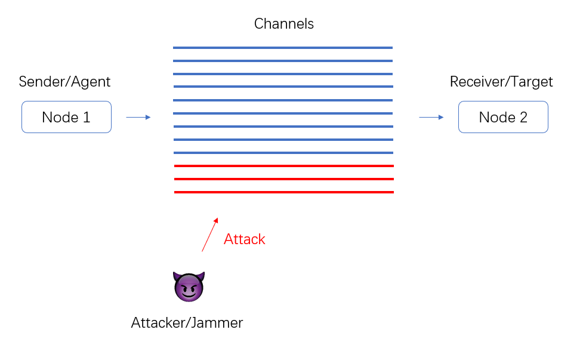
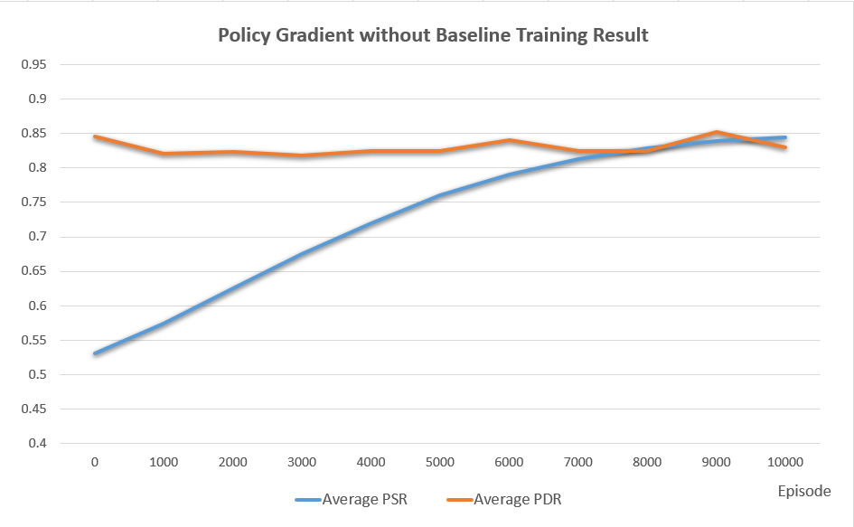
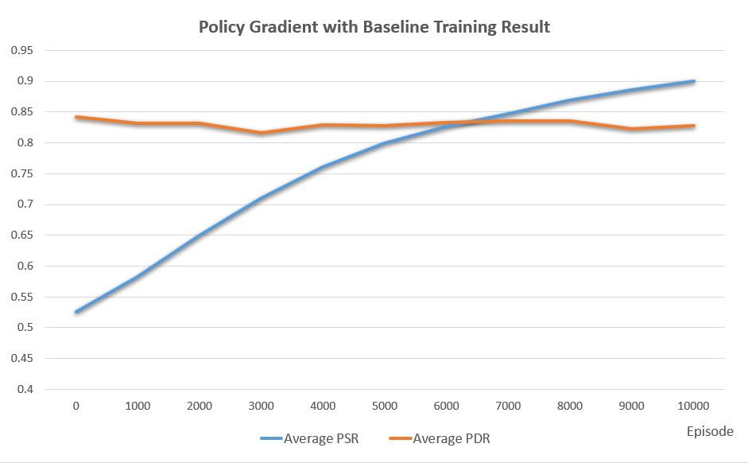
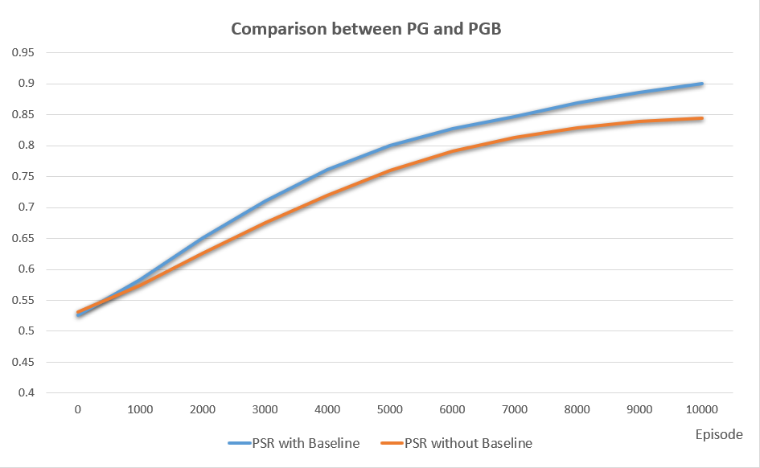

# IERG6130 Project
## Learning to Evade Jamming Attacks Using Reinforcement Learning
***

### Framework

The agent (node 1) wants to send packets to the target (node 2) through a channel, the jammer will occupy and attack some channels <font color=red>(red line)</font>, afterwards the packets sent from the occupied channel will fail, so the agent needs to move to other safe channels <font color=blue>(blue line)</font> to evade the jamming attack. The strategy of the jammer may be various, and the agent needs to handle the attack without knowing the strategy of attacker.



- States: different channels.

- Actions: switch the channels, whether send the packet or not.

- Reward: if the agent sent the packet and receive the ACK signal from receiver, reward = 1; if the agent sent the packet but no ACK signal received, reward = -1; otherwise, reward = 0.

- Done: if all the packets are successfully sent by the agent and successfully received by the agent

  

***

### Environment

Create the environment

```python
env = Env(Max_channel, Total_packets)
# Max_channel: Max number of channels
# Total_packets: Total number of packets need to be send
```

The attacker's strategy

```python
def (int) mode: # Attcker's strategy
    0: # No attack
    1: # Constant jammer, focus on several channels to continuously attack
    2: # Constant jammer, continuously randomly choose several channel to attack
    3: # Random jammer, switch back and forth between sleep and active, when active it focus on several channels to attack
    4: # Random jammer, switch back and forth between sleep and active, when active it will randomly choose several channels to attack
    5: # Reactive jammer, which can passively listen and obtain the communication channel used by the agent, and attack
```

Reset the environment

```python
env.reset(mode)
```

Interact with the environment

```python
state, reward, done, info = env.step(action)
# info = [PSR, PDR] which are the performance metrics, only available if done == True
# info = None if done == False
```

Directly test the environment

```python
python environment.py
```

***


### Environment Requirements

1. Python 3

2. Numpy

3. Random

4. **Pytorch**

These are the packets that we used in the IERG6130 Reinforcement Learning course.

***


### Challenge

- **Huge action space**, the agent need to decide not only which channel to go, but also when to send the packet.
- **Dynamic environment**, the attacked channels may switch due to the attacker's strategy, meanwhile, the attacker's strategy may also change from time to from.
- **Delayed reward**, the agent will receive the ACK signal from the target after sending another packet.


***

### Method

1. Model-free based, policy gradient without baseline reinforcement learning with **2 independent policy network**.

2. Model-free based, policy gradient with baseline reinforcement learning with **2 independent baseline network**.


***

### Trainning

Start to train agent 
```python
python pg-train.py # For policy gradient without baseline
python pgb-train.py # For policy gradient with baseline
```


***

### Performance Metrics

Normal standard in wireless communication.

- **Packet Send Ratio (PSR)**: The ratio of packets that are successfully sent out by agent compared to the number of packets it intends or needs to send out.
- **Packet Delivery Ratio (PDR)**: The ratio of packets that are successfully delivered to a destination compared to the number of packets that have been sent out by the sender, i.e., the ratio of packets that are successfully received by the receiver compared to the total packets successfully sent by the agent.

The Packet Send Ratio (PSR) intuitively indicates the packets sending rate of the agent, assume the bandwidth is not a concern under normal circumstances, then the strategy of agent when to send the packet will determine the performance of the Packet Send Ratio (PSR).

During the packets sending, the jamming attack will make the packets send by the agent (i.e., the packet is sent successfully) fail to receive by the receiver (i.e., not successfully received by receiver, if the agent doesn't receive the ACK signal from the receiver, the agent needs to resend the duplicate packet, which will cause the decrements of the Packet Delivery Ratio (PDR).

Therefore, one of the challenge of the agent is to find a trade-off of whether send packets or not. If the agent send too much packets in dangerous channel, the Packet Delivery Ratio (PDR) will be low because many successfully sent packets are not well received by the receiver, however, if the agent is very cautious in sending the packets, the Packet Send Ratio (PSR) will be bad due to the low packets sending rate.


***

### Result 

Here we show the results that during the 10,000 iterations of training by applying both policy gradient with/without baseline. Before showing the training result, we claim the practical meaning of the performance metrics:

- Higher Packet Send Ratio (PSR) means **higher packet transmission rate** during the wireless communication.

- Higher Packet Delivery Ratio (PDR) means **lower packet loss rate** during the wireless communication.

<center>
    
</center>

<center>

</center>

From the figures above we can conclude that both policy gradient with baseline and without baseline is evidently effective in stably increasing the Higher Packet Send Ratio (PSR). Meanwhile, the Higher Packet Delivery Ratio (PDR) is in a relatively stable state, which is not bad news since the agent improves the packet transmission rate as well as keep the packet loss rate in an acceptable range. So overall, the quality of wireless communications has been improved even in the presence of jamming attacks.

Then let's compare these two algorithm with each other,

<center>

</center>

From the figure above we can conclude that, compare to the policy gradient without baseline, the policy gradient with baseline has better performance in training the agent in terms of the Higher Packet Send Ratio (PSR).

The final agent packets together with the training log files are in the `./data` floder, the agent packets are named as `"xx_send_packet.pkl"` and `"xx_switch_channel.pkl"`, in which the `"xx"` are related to the algorithm we have applied.

Due to the limitation of time, we did not perform more iteration training. In future work, we will find the convergence point of these algorithms and conduct more analysis and make further improvements.

***

### Acknowledgements 

Thanks for the help from RLexample <https://github.com/cuhkrlcourse/RLexample> in CUHK RL course.