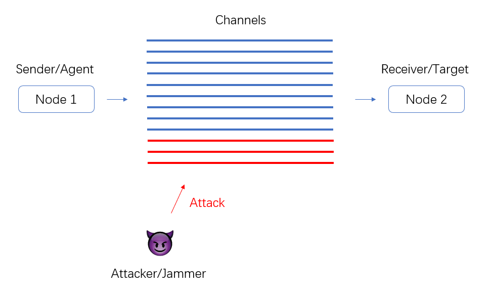

# IERG6130 Project
## Learning to Evade Jamming Attacks Using Reinforcement Learning
***

### Framework

The agent (node 1) wants to send packets to the target (node 2) through a channel, the jammer will occupy and attack some channels <font color=red>(red line)</font>, afterwards the packets sent from the occupied channel will fail, so the agent needs to move to other safe channels <font color=blue>(blue line)</font> to evade the jamming attack. The strategy of the jammer may be various, and the agent needs to handle the attack without knowing the strategy of attacker.



- States: different channels

- Actions: switch the channels

  

***

### Environment

Create the environment

```python
env = Env(Max_channel, Total_packets)
# Max_channel: Max number of channels
# Total_packets: Total number of packets need to be send
```

The attacker's strategy

```python
def (int) mode: # Attcker's strategy
    0: # No attack
    1: # Randomly choose only ONE channel to attack
    2: # Randomly choose only HALF channels to attack
```

Reset the environment

```python
env.reset(mode)
```

Interact with the environment

```python
state, reward, done, info = env.step(action)
```

Output the time cost for sending all the packets

```python
print(env.time)
```

Directly test the environment

```python
python Env.py
```


***

### Challenge

- **Huge action space**, which is almost equivalent to the state space.
- **Dynamic environment**, the attacked channels may switch due to the attacker's strategy, meanwhile, the attacker's strategy may also change from time to from.
- **Delayed reward**, the agent will receive the ACK signal from the target after sending another packet.


***

### Method

Model-free based, policy based reinforcement learning (Details to be determined)